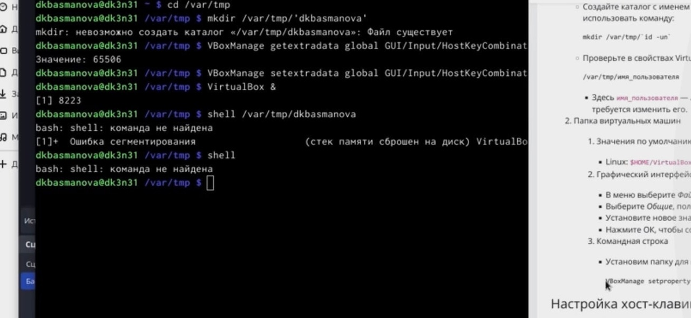
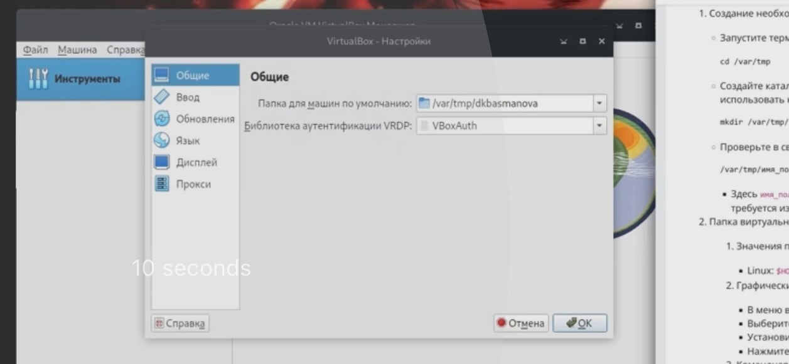
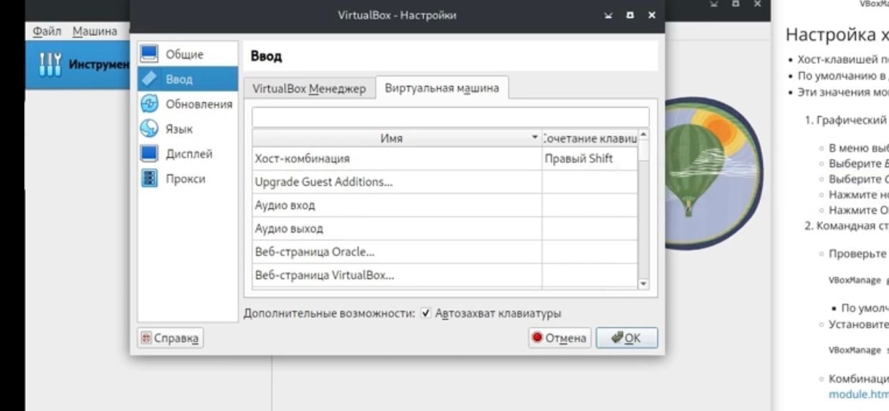
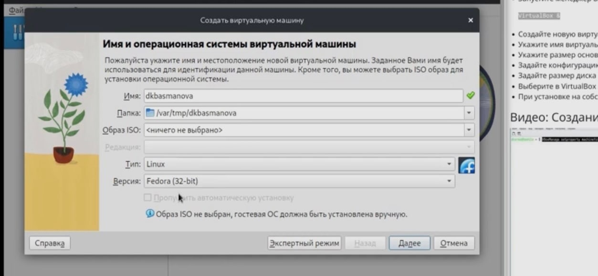
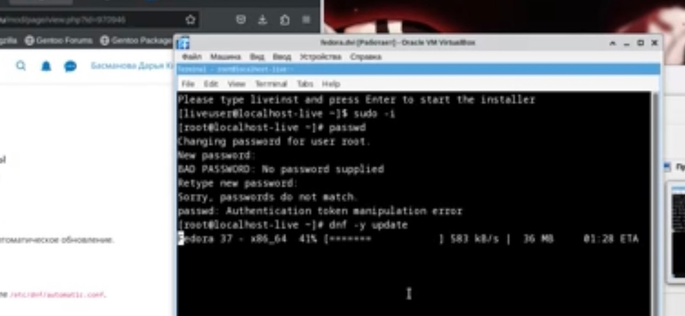
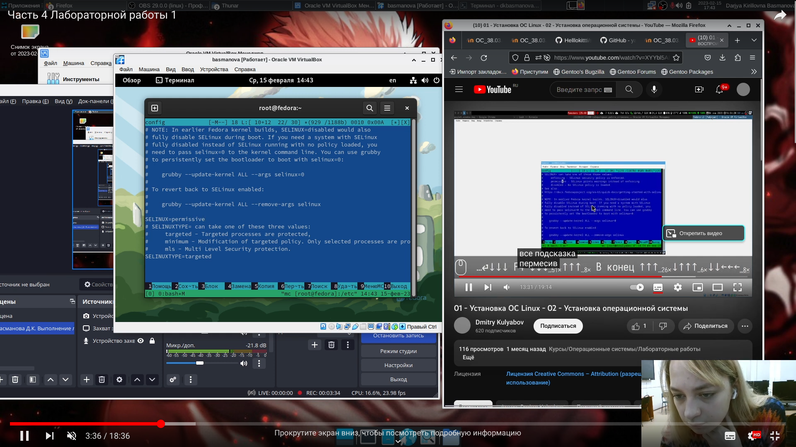
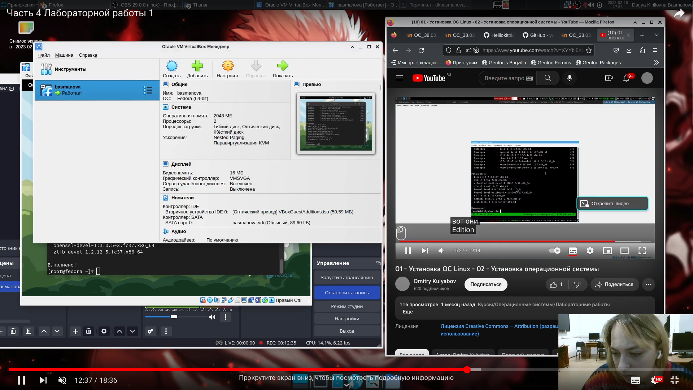

---
## Front matter
title: "Лабораторная работа №1"
subtitle: "Архитектура вычислительных систем"
author: "Басманова Дарья Кириллова"

## Generic otions
lang: ru-RU
toc-title: "Содержание"

## Bibliography
bibliography: bib/cite.bib
csl: pandoc/csl/gost-r-7-0-5-2008-numeric.csl

## Pdf output format
toc: true # Table of contents
toc-depth: 2
lof: true # List of figures

fontsize: 12pt
linestretch: 1.5
papersize: a4
documentclass: scrreprt
## I18n polyglossia
polyglossia-lang:
  name: russian
  options:
	- spelling=modern
	- babelshorthands=true
polyglossia-otherlangs:
  name: english
## I18n babel
babel-lang: russian
babel-otherlangs: english
## Fonts
mainfont: PT Serif
romanfont: PT Serif
sansfont: PT Sans
monofont: PT Mono
mainfontoptions: Ligatures=TeX
romanfontoptions: Ligatures=TeX
sansfontoptions: Ligatures=TeX,Scale=MatchLowercase
monofontoptions: Scale=MatchLowercase,Scale=0.9
## Biblatex
biblatex: true
biblio-style: "gost-numeric"
biblatexoptions:
  - parentracker=true
  - backend=biber
  - hyperref=auto
  - language=auto
  - autolang=other*
  - citestyle=gost-numeric
## Pandoc-crossref LaTeX customization
figureTitle: "Рис."
tableTitle: "Таблица"
listingTitle: "Листинг"
lofTitle: "Список иллюстраций"
lotTitle: "Список таблиц"
lolTitle: "Листинги"
## Misc options
indent: true
header-includes:
  - \usepackage{indentfirst}
  - \usepackage{float} # keep figures where there are in the text
  - \floatplacement{figure}{H} # keep figures where there are in the text
---

# Цель работы

Целью данной работы является приобретение практических навыков установки операционной системы на виртуальную машину, настройки минимально необходимых для дальнейшей работы сервисов

# Задание

Лабораторная работа подразумевает установку на виртуальную машину VirtualBox.

# Выполнение лабораторной работы

1) Запустиv терминал. Перейдtv в каталог /var/tmp:
Создаlbv каталог с именем пользователя (совпадающий с логином в дисплейном классе). 

{#fig:001 width=70%}

2) Настройка хост-клавиши
 Хост-клавишей по умолчанию является правый Ctrl. По умолчанию в дисплейных классах на клавише правый Ctrl находится переключатель языка ввода.
 
        В меню выберите Файл, Настройки.
        Выберите Ввод, вкладка Виртуальная машина.
        Выберите Сочетание клавиш в строке Хост-комбинация.
        Нажмите новое сочетание клавиш.
        Нажмите ОК, чтобы сохранить изменения.

   Сделаем нужную клавижу (Меню)

   
{#fig:002 width=70%}
{#fig:003 width=70%}

3) Создание виртуальной машины
Запустим менеджер виртуальных машин, введя в командной строке:

    Создадим новую виртуальную машину.
    Укажем имя виртуальной машины (логин в дисплейном классе), тип операционной системы — Linux, Fedora.
    Укажем размер основной памяти виртуальной машины — от 2048 МБ.
    Зададим конфигурацию жёсткого диска — загрузочный, VDI (VirtualBox Disk Image), динамический виртуальный диск.
    Зададим размер диска — 80 ГБ (или больше), его расположение
    Выберем в VirtualBox Вашей виртуальной машины. Добавьте новый привод оптических дисков и выберите образ.
  
{#fig:004 width=70%}

4) После установки 
    Выбираем язык интерфейса и перейдем к настройкам установки операционной системы.
    Место установки ОС оставляем без изменения.
    Установим имя и пароль для пользователя root.
    Установим имя и пароль для Вашего пользователя.
    Зададим сетевое имя Вашего компьютера.
    После завершения установки операционной системы корректно перезапустим виртуальную машину.
    В VirtualBox оптический диск должен отключиться автоматически.

5) Войдем в в ОС под заданной при установке учётной записью.
    Нажмем комбинацию Win+Enter для запуска терминала.

    Переключитесь на роль супер-пользователя:

    sudo -i
{#fig:005 width=70%}
Обновления
Обновить все пакеты
Повышение комфорта работы   
Автоматическое обновление
 При необходимости можно использовать автоматическое обновление
    Установка программного обеспечения:
    dnf install dnf-automatic
    Задаёте необходимую конфигурацию в файле /etc/dnf/automatic.conf.
    Запустите таймер:
    systemctl enable --now dnf-automatic.timer
Отключение SELinux
    В данном курсе мы не будем рассматривать работу с системой безопасности SELinux.
    Поэтому отключим его.
    В файле /etc/selinux/config замените значение
    SELINUX=enforcing

    на значение

    SELINUX=permissive
{#fig:006 width=70%}
    Перегрузите виртуальную машину:

    reboot
готовая машина
{#fig:007 width=70%}

ответы на вопросы: 

                  Контрольные вопросы 
1. Какую информацию содержит учётная запись пользователя? 
2. Укажите команды терминала и приведите примеры: – для получения справки по команде; – для перемещения по файловой системе; – для просмотра содержимого каталога; – для определения объёма каталога; – для создания / удаления каталогов / файлов; – для задания определённых прав на файл / каталог; – для просмотра истории команд. 
3. Что такое файловая система? Приведите примеры с краткой характеристикой. 
4. Как посмотреть, какие файловые системы подмонтированы в ОС? 
5. Как удалить зависший процесс?

 Ответы-

1.имя и пароль

2.info
mv
ls
du
Mkdir
Chmod
History

3.Файловая система- это часть операционной системы, суть которой состоит в том, чтобы обеспечить пользователю удобный интерфейс при работе с данными, хранящимися на диске, и обеспечить совместное использование файлов несколькими пользователями и процессами.

информация о разрешенном доступе,
пароль для доступа к файлу,
владелец файла,
создатель файла,
признак "только для чтения",
признак "скрытый файл",
признак "системный файл",
признак "архивный файл",
признак "двоичный/символьный",
признак "временный" (удалить после завершения процесса),
признак блокировки,
длина записи,
указатель на ключевое поле в записи,
длина ключа,
времена создания, последнего доступа и последнего изменения,
текущий размер файла,
максимальный размер файла. 

4)Делается это при помощи команды mount 

5) Команда kill

# Выводы

Я приобрела практические навыки установки операционной системы на виртуальную машину, настройки минимально необходимых для дальнейшей работы сервисов.

