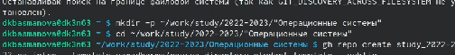
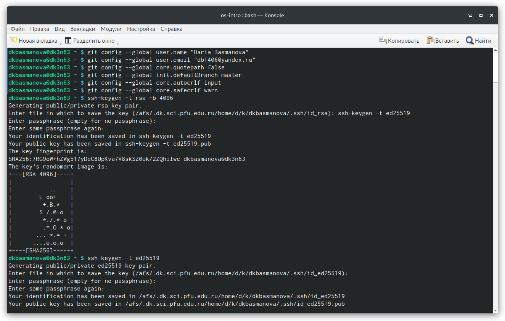
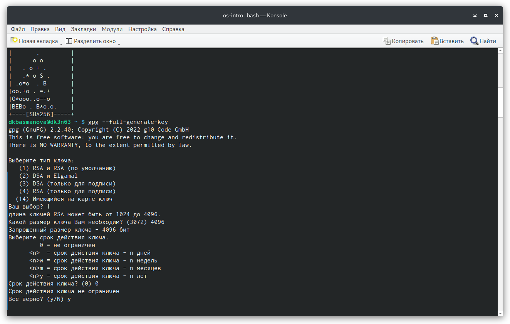
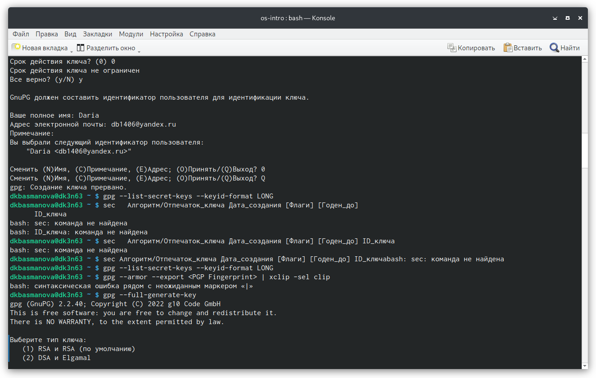
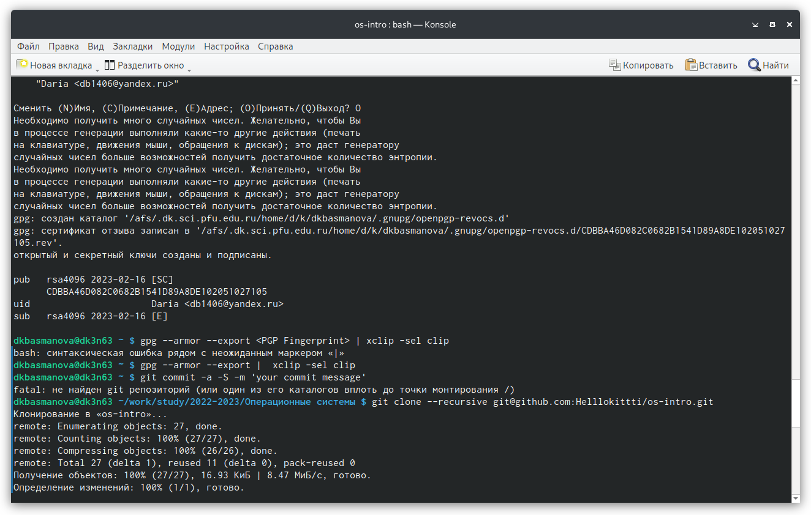
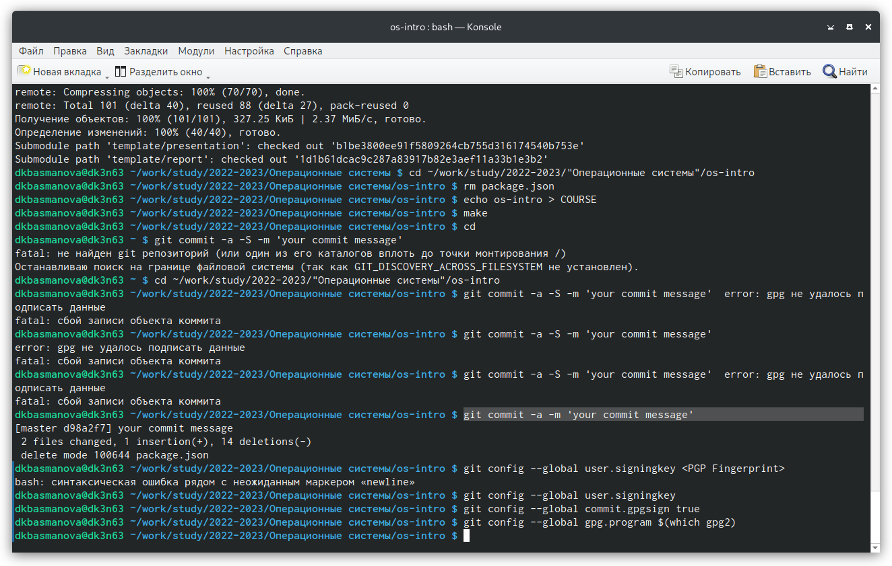

---
## Front matter
lang: ru-RU
title: Лаборатрная рабта №2
subtitle: Простейший шаблон
author:
  - Басманова Дарья
institute:
  - Российский университет дружбы народов, Москва, Россия
date: 17 февраля 2023

## i18n babel
babel-lang: russian
babel-otherlangs: english

## Formatting pdf
toc: false
toc-title: Содержание
slide_level: 2
aspectratio: 169
section-titles: true
theme: metropolis
header-includes:
 - \metroset{progressbar=frametitle,sectionpage=progressbar,numbering=fraction}
 - '\makeatletter'
 - '\beamer@ignorenonframefalse'
 - '\makeatother'
---

# Информация

## Докладчик

:::::::::::::: {.columns align=center}
::: {.column width="70%"}

  * Басманова дарья
  * студентка группы НБИбд-01-22
  * Российский университет дружбы народов


:::
::::::::::::::

## Актуальность

Лабораторная работа актуальна для тех, кто желает научиться пользоваться гитхабом

## Цели и задачи

- Научиться работать с репозиториями и ключами гитхаба

## Материалы и методы

- Процессор `pandoc` для входного формата Markdown
- Результирующие форматы
	- `pdf`
	- `html`
- Автоматизация процесса создания: `Makefile`

# Создание презентации

## Процессор `pandoc`

- Pandoc: преобразователь текстовых файлов
- Сайт: <https://pandoc.org/>
- Репозиторий: <https://github.com/jgm/pandoc>

## Формат `pdf`

- Использование LaTeX
- Пакет для презентации: [beamer](https://ctan.org/pkg/beamer)
- Тема оформления: `metropolis`

## Код для формата `pdf`

```yaml
slide_level: 2
aspectratio: 169
section-titles: true
theme: metropolis
```

## Формат `html`

- Используется фреймворк [reveal.js](https://revealjs.com/)
- Используется [тема](https://revealjs.com/themes/) `beige`

## Код для формата `html`

- Тема задаётся в файле `Makefile`

```make
REVEALJS_THEME = beige 
```
# Результаты

## Получающиеся форматы

- Полученный `pdf`-файл можно демонстрировать в любой программе просмотра `pdf`
- Полученный `html`-файл содержит в себе все ресурсы: изображения, css, скрипты
.

## Содержание исследования

1. ЗДля начала работы нам необходимо создать шаблон рабочего пространства. 
Для нашего учебного года и предмета "Операционные системы" (код предмета os-intro) создание репозитория примет следующий вид: (рис. [-@fig:001])

{#fig:001 width=90%}
	
##

2.  Сделаем базовую настройку git. Во первых, зададим имя и почту владельца репозитория. Далее настрим utf-8 в выводе сообщений git. Зададим имя начальной ветки. Далее настроим параметр autocrlf и saferlf. (рис. [-@fig:001])

{#fig:002 width=90%}

##

3. 3) Создадим Ключи ssh По алгоритму rsa создадим с ключём размером 4096 бит. А так же по алгоритму ed25519. 

##

4. Создаём GPG ключ. (рис. [-@fig:002])

{#fig:003 width=90%}

##

5. Добавим PGP ключа в Github. (рис. [-@fig:003]) 

{#fig:004 width=90%}

{#fig:005 width=90%}

##

6. Настройка автоматических подписей коммитов git. Используя введёный email, укажtv Git применять его при подписи коммитов. (рис. [-@fig:011]) 

{#fig:006 width=90%}


##

7. Отправляем работу на гитхаб

## ОТВЕТЫ НА ВОПРОСЫ

1. Какую информацию содержит учётная запись пользователя? 
2. Укажите команды терминала и приведите примеры: – для получения справки по команде; – для перемещения по файловой системе; – для просмотра содержимого каталога; – для определения объёма каталога; – для создания / удаления каталогов / файлов; – для задания определённых прав на файл / каталог; – для просмотра истории команд. 
3. Что такое файловая система? Приведите примеры с краткой характеристикой. 
4. Как посмотреть, какие файловые системы подмонтированы в ОС? 
5. Как удалить зависший процесс? Ответы- 1.имя и пароль 2.info mvls du Mkdir Chmod History. 3.Файловая система- это часть операционной системы, суть которой состоит в том, чтобы обеспечить пользователю удобный интерфейс при работе с данными, хранящимися на диске, и обеспечить совместное использование файлов несколькими пользователями и процессами. информация о разрешенном доступе, пароль для доступа к файлу, владелец файла, создатель файла, признак "только для чтения", признак "скрытый файл", признак "системный файл", признак "архивный файл", признак "двоичный/символьный", признак "временный" (удалить после завершения процесса), признак блокировки, длина записи, указатель на ключевое поле в записи, длина ключа, времена создания, последнего доступа и последнего изменения, текущий размер файла, максимальный размер файла. 4)Делается это при помощи команды mount 5) Команда kill


## Итоговый слайд

- В ходе выполнения лабораторной работы, мы изучили идеологию и применение средств контроля версий и освоили умения работать с git.


