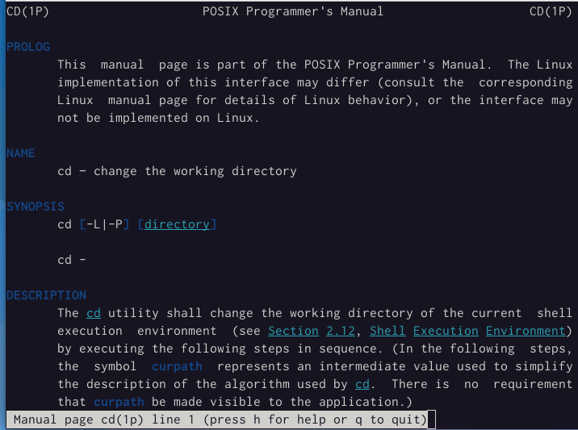

---
## Front matter
lang: ru-RU
title: Структура научной презентации
subtitle: Простейший шаблон
author:
  - Басманова Д.К.
institute:
  - Российский университет дружбы народов, Москва, Россия
date: 03 марта 2023

## i18n babel
babel-lang: russian
babel-otherlangs: english

## Formatting pdf
toc: false
toc-title: Содержание
slide_level: 2
aspectratio: 169
section-titles: true
theme: metropolis
header-includes:
 - \metroset{progressbar=frametitle,sectionpage=progressbar,numbering=fraction}
 - '\makeatletter'
 - '\beamer@ignorenonframefalse'
 - '\makeatother'
---

# Информация

## Докладчик

:::::::::::::: {.columns align=center}
::: {.column width="70%"}

  * Басманова Дарья Кирилловна
  * Российский университет дружбы народов
:::
::::::::::::::

# Вводная часть

## Актуальность

Работа актуальна для тех, кто хочет научиться взаимодействать пользователя с системой посредством командной строки.


## Цели и задачи

Приобретение практических навыков взаимодействия пользователя с системой посредством командной строки


# Создание презентации

## Процессор `pandoc`

- Pandoc: преобразователь текстовых файлов
- Сайт: <https://pandoc.org/>
- Репозиторий: <https://github.com/jgm/pandoc>

## Формат `pdf`

- Использование LaTeX
- Пакет для презентации: [beamer](https://ctan.org/pkg/beamer)
- Тема оформления: `metropolis`

## Код для формата `pdf`

```yaml
slide_level: 2
aspectratio: 169
section-titles: true
theme: metropolis
```

## Формат `html`

- Используется фреймворк [reveal.js](https://revealjs.com/)
- Используется [тема](https://revealjs.com/themes/) `beige`

## Код для формата `html`

- Тема задаётся в файле `Makefile`

```make
REVEALJS_THEME = beige 
```
# Результаты

## Получающиеся форматы

- Полученный `pdf`-файл можно демонстрировать в любой программе просмотра `pdf`
- Полученный `html`-файл содержит в себе все ресурсы: изображения, css, скрипты

# Элементы презентации

##1) Первым делом переходим в каталог /tmp и выводим содержимое этого каталога с помощью команды ls.

{#fig:001 width=65%}

##2) Проверяем есть ли в каталоге /var/spool подкаталог с именем cron. Он есть.

{#fig:002 width=65%}

##3) Переходим с помощью команды cd в наш домашний каталог, выводим содержимое каталога. 

{#fig:003 width=65%}

##4) Создаем в домашшнем каталоге новый каталог с именем newdir. Проверяем создали ли его. 

{#fig:004 width=65%}

##5) Создадим каталог morefun в каталоге newdir. Проверяем. 
{#fig:005 width=65%}

##6) Создадим одной командой три новых каталога с именами letters, memos, misk. Затем одной командой их удалим. 

{#fig:006 width=65%}
{#fig:007 width=65%}

##7) Удаляем каталог /newdir командой -rm. Проверяем удаление.


##8) Удаляем каталог morefun. Проверяем.

{#fig:009 width=65%}

##9) С помощью команды man определяем, какую опцию команды ls нужно использовать для просмотра содержимое не только указанного каталога, но и подкаталогов, входящих в него, и опцию, позволяющую отсортировать по времени последнего изменения выводимый список содержимого каталога с развёрнутым описанием файлов.

{#fig:010 width=65%}
{#fig:008 width=65%}
{#fig:009 width=65%}

##10) С помощью команды просмотрим описания следующих команд: cd, pwd, mkdir, rmdir, rm. 

{#fig:013 width=65%}
{#fig:014 width=65%}
{#fig:015 width=65%}
{#fig:016 width=65%}
{#fig:017 width=65%}

##11) Используя информацию, полученную при помощи команды history, выполним модификацию и исполнение нескольких команд из буфера команд

{#fig:018 width=65%}
{#fig:019 width=65%}
{#fig:020 width=65%}


## Итоговый слайд

Я приобрела практические навыки взаимодействия пользователя с системой посредством командной строки.

:::

