---
## Front matter
title: "Лабораторная работа №4"
subtitle: "Операционные системы"
author: "Басманова Дарья Кириллова"

## Generic otions
lang: ru-RU
toc-title: "Содержание"

## Bibliography
bibliography: bib/cite.bib
csl: pandoc/csl/gost-r-7-0-5-2008-numeric.csl

## Pdf output format
toc: true # Table of contents
toc-depth: 2
lof: true # List of figures

fontsize: 12pt
linestretch: 1.5
papersize: a4
documentclass: scrreprt
## I18n polyglossia
polyglossia-lang:
  name: russian
  options:
	- spelling=modern
	- babelshorthands=true
polyglossia-otherlangs:
  name: english
## I18n babel
babel-lang: russian
babel-otherlangs: english
## Fonts
mainfont: PT Serif
romanfont: PT Serif
sansfont: PT Sans
monofont: PT Mono
mainfontoptions: Ligatures=TeX
romanfontoptions: Ligatures=TeX
sansfontoptions: Ligatures=TeX,Scale=MatchLowercase
monofontoptions: Scale=MatchLowercase,Scale=0.9
## Biblatex
biblatex: true
biblio-style: "gost-numeric"
biblatexoptions:
  - parentracker=true
  - backend=biber
  - hyperref=auto
  - language=auto
  - autolang=other*
  - citestyle=gost-numeric
## Pandoc-crossref LaTeX customization
figureTitle: "Рис."
tableTitle: "Таблица"
listingTitle: "Листинг"
lofTitle: "Список иллюстраций"
lotTitle: "Список таблиц"
lolTitle: "Листинги"
## Misc options
indent: true
header-includes:
  - \usepackage{indentfirst}
  - \usepackage{float} # keep figures where there are in the text
  - \floatplacement{figure}{H} # keep figures where there are in the text
---

# Цель работы

Приобретение практических навыков взаимодействия пользователя с системой посредством командной строки.

# Выполнение лабораторной работы

1) Первым делом переходим в каталог /tmp и выводим содержимое этого каталога с помощью команды ls.

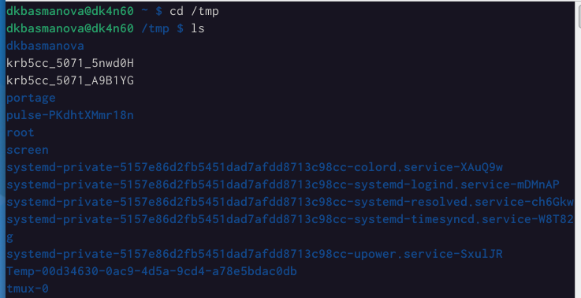{#fig:001 width=65%}

2) Проверяем есть ли в каталоге /var/spool подкаталог с именем cron. Он есть.

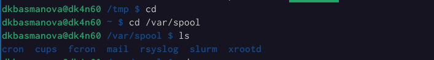{#fig:002 width=65%}

3) Переходим с помощью команды cd в наш домашний каталог, выводим содержимое каталога. 

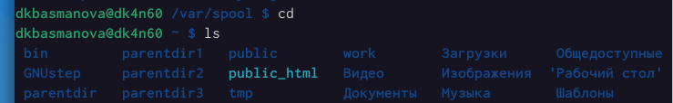{#fig:003 width=65%}

4) Создаем в домашшнем каталоге новый каталог с именем newdir. Проверяем создали ли его. 

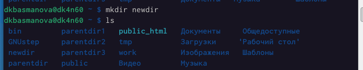{#fig:004 width=65%}

5) Создадим каталог morefun в каталоге newdir. Проверяем. 

{#fig:005 width=65%}

6) Создадим одной командой три новых каталога с именами letters, memos, misk. Затем одной командой их удалим. 

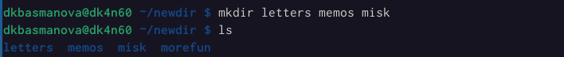{#fig:006 width=65%}
{#fig:007 width=65%}

7) Удаляем каталог /newdir командой -rm. Проверяем удаление.

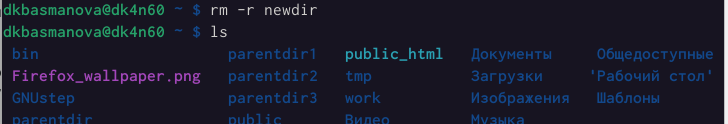{#fig:008 width=65%}

8) Удаляем каталог morefun. Проверяем.

{#fig:009 width=65%}

9) С помощью команды man определяем, какую опцию команды ls нужно использовать для просмотра содержимое не только указанного каталога, но и подкаталогов, входящих в него, и опцию, позволяющую отсортировать по времени последнего изменения выводимый список содержимого каталога с развёрнутым описанием файлов.

{#fig:010 width=65%}
{#fig:008 width=65%}
{#fig:009 width=65%}

10) С помощью команды просмотрим описания следующих команд: cd, pwd, mkdir, rmdir, rm. 

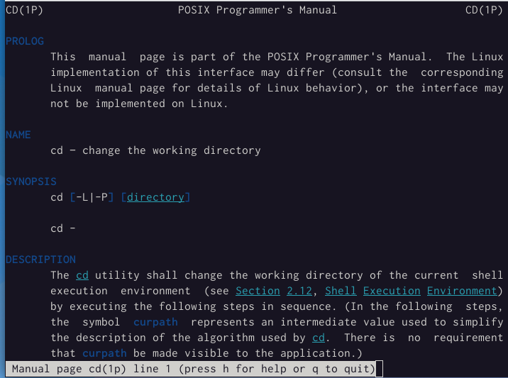{#fig:013 width=65%}
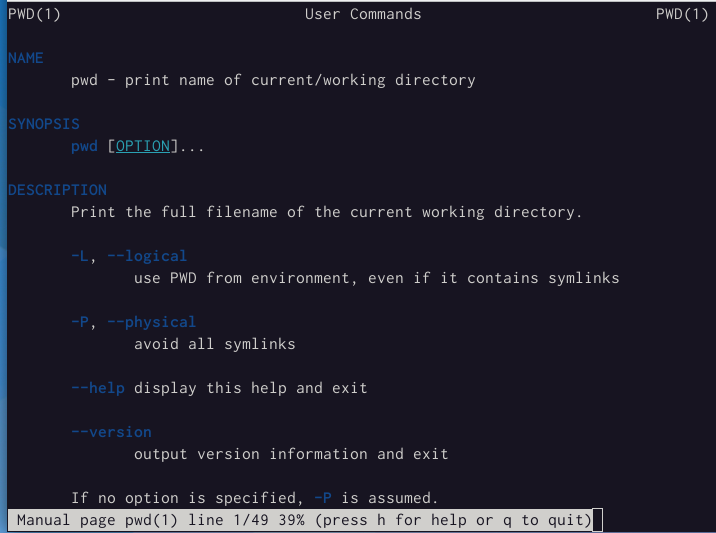{#fig:014 width=65%}
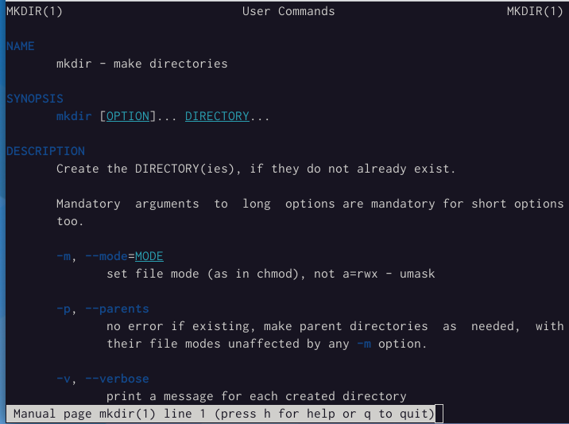{#fig:015 width=65%}
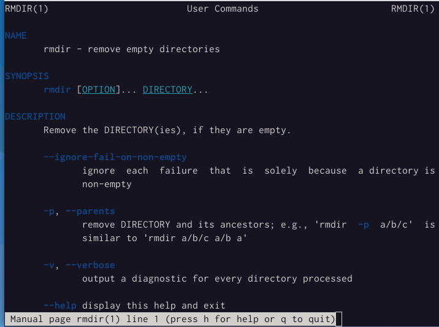{#fig:016 width=65%}
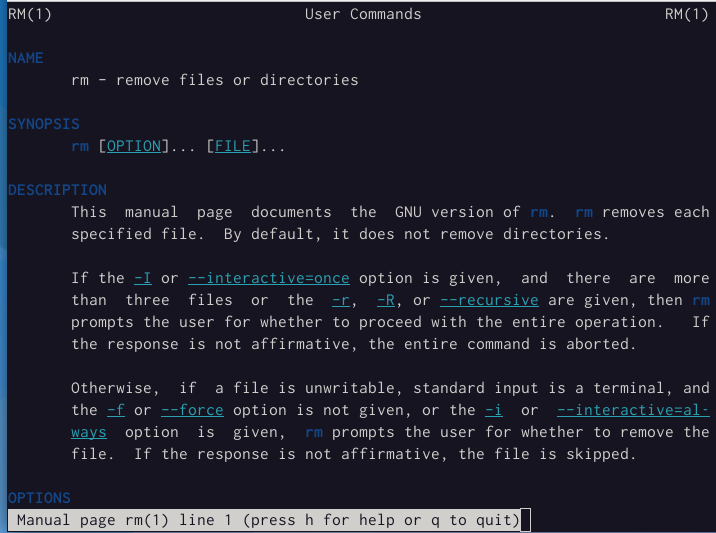{#fig:017 width=65%}

11) Используя информацию, полученную при помощи команды history, выполним модификацию и исполнение нескольких команд из буфера команд

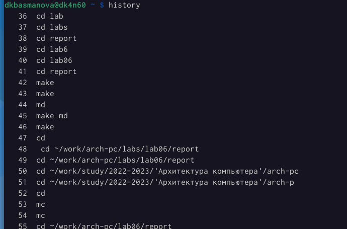{#fig:018 width=65%}
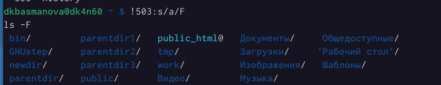{#fig:019 width=65%}
{#fig:020 width=65%}

# Выводы

Я приобрела практические навыки взаимодействия пользователя с системой посредством командной строки.

