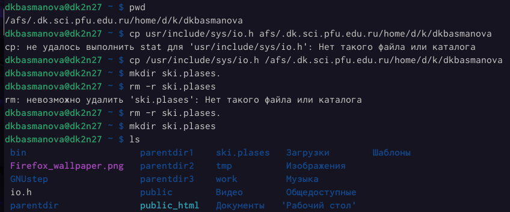
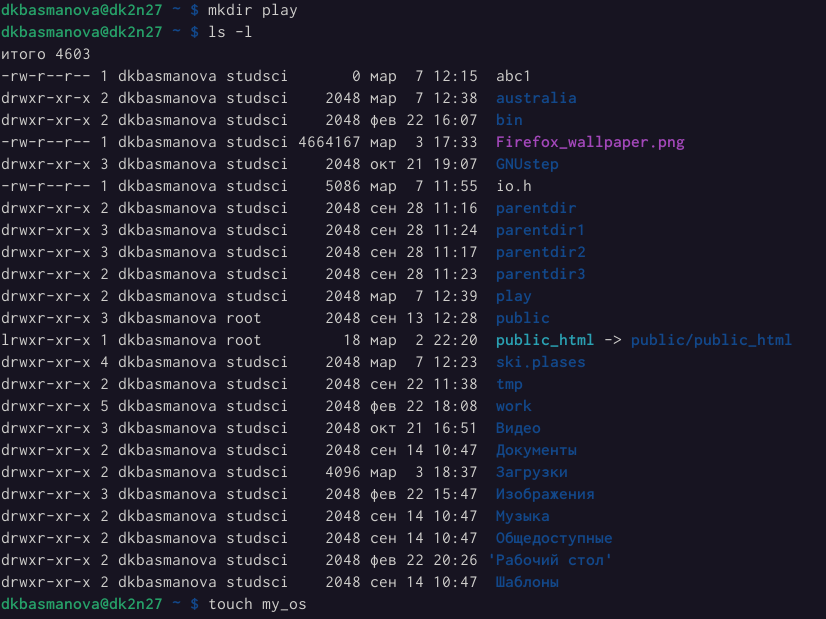
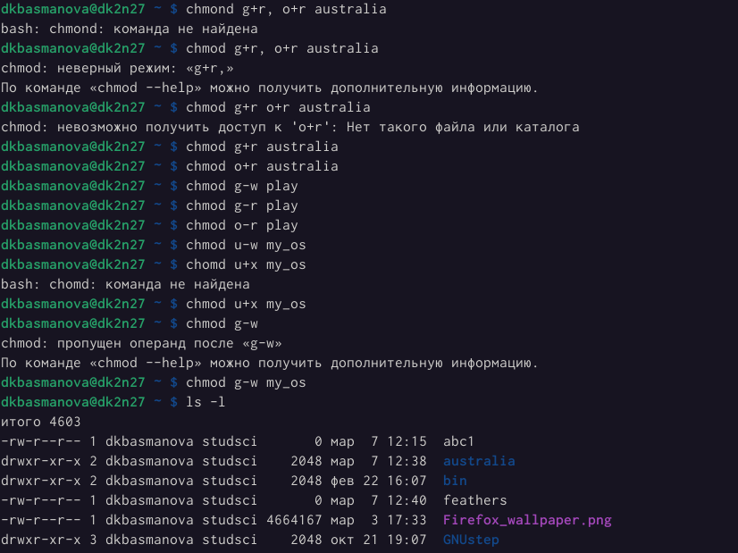
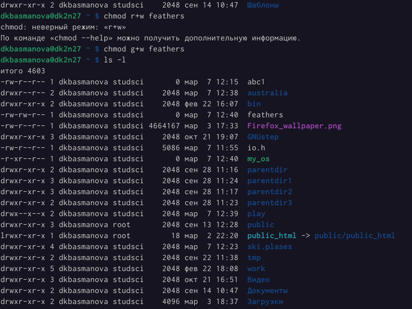
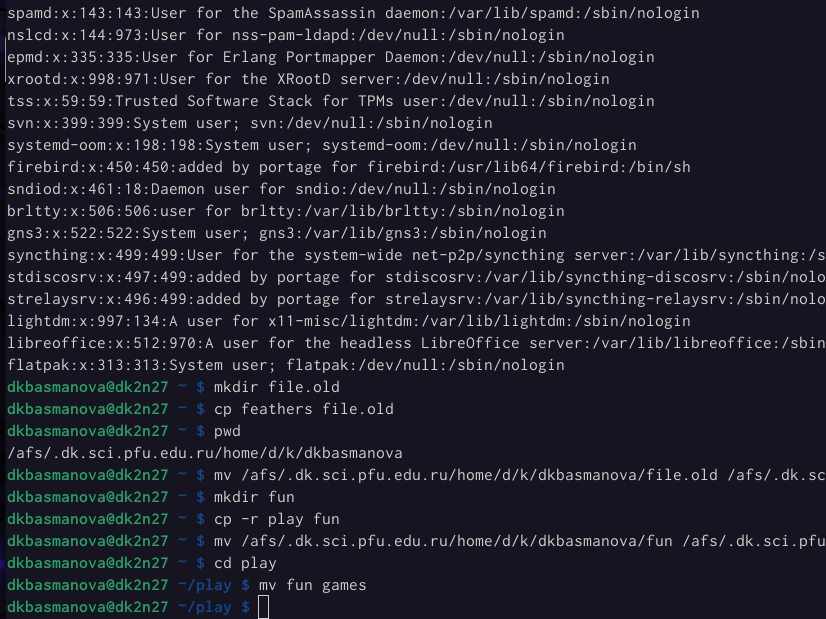
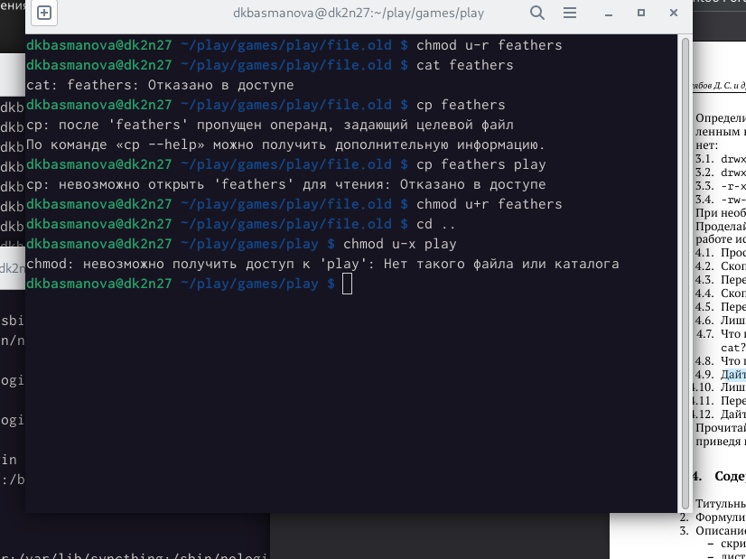
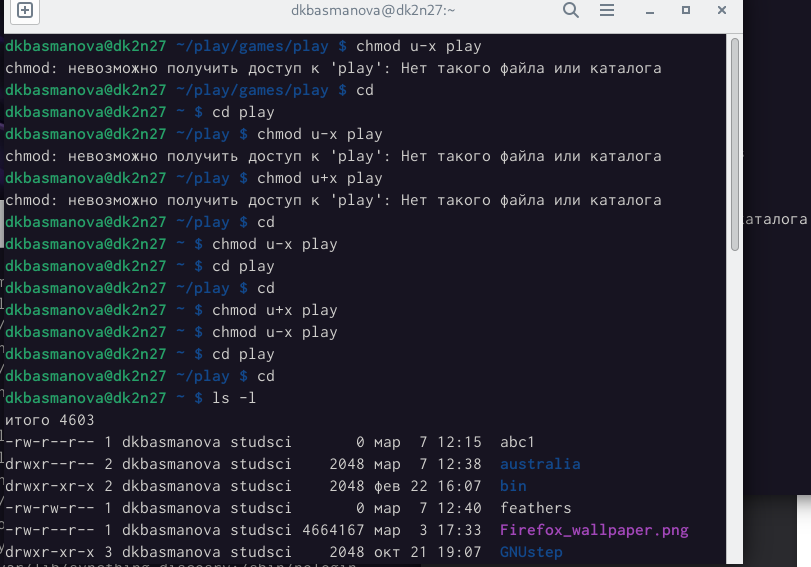
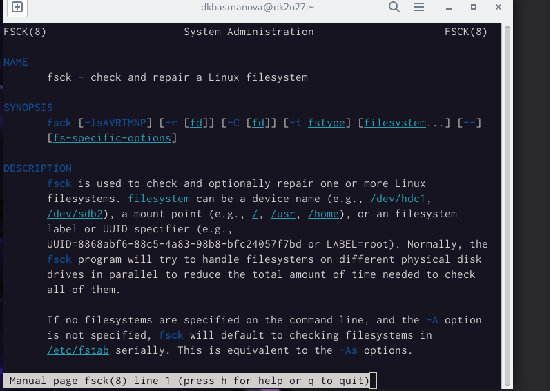
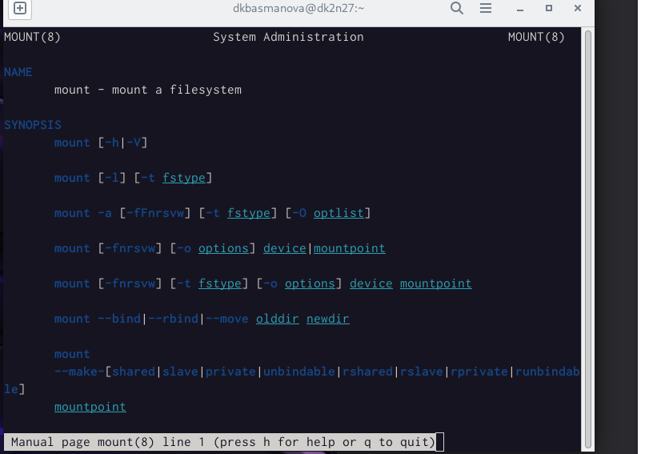

---
## Front matter
title: "Лабораторная работа №5"
subtitle: "Операционные системы"
author: "Басманова Дарья Кириллова"

## Generic otions
lang: ru-RU
toc-title: "Содержание"

## Bibliography
bibliography: bib/cite.bib
csl: pandoc/csl/gost-r-7-0-5-2008-numeric.csl

## Pdf output format
toc: true # Table of contents
toc-depth: 2
lof: true # List of figures

fontsize: 12pt
linestretch: 1.5
papersize: a4
documentclass: scrreprt
## I18n polyglossia
polyglossia-lang:
  name: russian
  options:
	- spelling=modern
	- babelshorthands=true
polyglossia-otherlangs:
  name: english
## I18n babel
babel-lang: russian
babel-otherlangs: english
## Fonts
mainfont: PT Serif
romanfont: PT Serif
sansfont: PT Sans
monofont: PT Mono
mainfontoptions: Ligatures=TeX
romanfontoptions: Ligatures=TeX
sansfontoptions: Ligatures=TeX,Scale=MatchLowercase
monofontoptions: Scale=MatchLowercase,Scale=0.9
## Biblatex
biblatex: true
biblio-style: "gost-numeric"
biblatexoptions:
  - parentracker=true
  - backend=biber
  - hyperref=auto
  - language=auto
  - autolang=other*
  - citestyle=gost-numeric
## Pandoc-crossref LaTeX customization
figureTitle: "Рис."
tableTitle: "Таблица"
listingTitle: "Листинг"
lofTitle: "Список иллюстраций"

lolTitle: "Листинги"
## Misc options
indent: true
header-includes:
  - \usepackage{indentfirst}
  - \usepackage{float} # keep figures where there are in the text
  - \floatplacement{figure}{H} # keep figures where there are in the text
---

# Цель работы

Ознакомление с файловой системой Linux, её структурой, именами и содержанием
каталогов. Приобретение практических навыков по применению команд для работы
с файлами и каталогами, по управлению процессами (и работами), по проверке исполь-
зования диска и обслуживанию файловой системы.

# Задание

1.Выполните все примеры, приведённые в первой части описания лабораторной работы.
2.Выполните следующие действия, зафиксировав в отчёте по лабораторной работе
используемые при этом команды и результаты их выполнения:
2.1. Скопируйте файл /usr/include/sys/io.h в домашний каталог и назовите его
equipment. Если файла io.h нет, то используйте любой другой файл в каталоге
/usr/include/sys/ вместо него.
2.2.В домашнем каталоге создайте директорию ~/ski.plases.
2.3.Переместите файл equipment в каталог ~/ski.plases.
2.4.Переименуйте файл ~/ski.plases/equipment в ~/ski.plases/equiplist.
2.5.Создайте в домашнем каталоге файл abc1 и скопируйте его в каталог
~/ski.plases, назовите его equiplist2.
2.6.Создайте каталог с именем equipment в каталоге ~/ski.plases.
2.7.Переместите файлы ~/ski.plases/equiplist и equiplist2 в каталог
~/ski.plases/equipment.
2.8. Создайте и переместите каталог ~/newdir в каталог ~/ski.plases и назовите
его plan
3.Определите опции команды chmod, необходимые для того, чтобы присвоить перечис-
ленным ниже файлам выделенные права доступа, считая, что в начале таких прав
нет:
3.1.drwxr--r-- ... australia
3.2.drwx--x--x ... play
3.3.-r-xr--r-- ... my_os
3.4.-rw-rw-r-- ... feathers
При необходимости создайте нужные файлы.
4.Проделайте приведённые ниже упражнения, записывая в отчёт по лабораторной
работе используемые при этом команды:
4.1.Просмотрите содержимое файла /etc/password.
4.2.Скопируйте файл ~/feathers в файл ~/file.old.
4.3.Переместите файл ~/file.old в каталог ~/play.
4.4.Скопируйте каталог ~/play в каталог ~/fun.
4.5.Переместите каталог ~/fun в каталог ~/play и назовите его games.
4.6.Лишите владельца файла ~/feathers права на чтение.
4.7.Что произойдёт, если вы попытаетесь просмотреть файл ~/feathers командой
cat?
4.8.Что произойдёт, если вы попытаетесь скопировать файл ~/feathers?
4.9.Дайте владельцу файла ~/feathers право на чтение.
4.10.Лишите владельца каталога ~/play права на выполнение.
4.11.Перейдите в каталог ~/play. Что произошло?
4.12.Дайте владельцу каталога ~/play право на выполнение.
5.Прочитайте man по командам mount, fsck, mkfs, kill и кратко их охарактеризуйте,
приведя примеры

# Выполнение лабораторной работы

После изучения теоритического материала и выполнения всех примеров, мы приступаем к выполнению лабораторной работы.

Описываются проведённые действия, в качестве иллюстрации даётся ссылка на иллюстрацию (рис. @fig:001).
Для начала узнаем адрес своей домашней папки с помощью команды pwd.
Скопируем файл /usr/include/sys/io.h в домашний каталог и назовем его equipment. В домашнем каталоге создадим директорию ~/ski.plases и проверим его создание. 

{#fig:001 width=70%}

Описываются проведённые действия, в качестве иллюстрации даётся ссылка на иллюстрацию (рис. @fig:002).

Переместим файл equipment в каталог ~/ski.plases.
Переименуем файл ~/ski.plases/equipment в ~/ski.plases/equiplist.
Создадим в домашнем каталоге файл abc1 и скопируем его в каталог ~/ski.plases, назовем его equiplist2.
Создадим каталог с именем equipment в каталоге ~/ski.plases.
Переместим файлы ~/ski.plases/equiplist и equiplist2 в каталог ~/ski.plases/equipment.

{#fig:002 width=70%}

Описываются проведённые действия, в качестве иллюстрации даётся ссылка на иллюстрацию (рис. @fig:003).

Создадим и переместим каталог ~/newdir в каталог ~/ski.plases и назовем его plans.
Определим опции команды chmod, необходимые для того, чтобы присвоить перечисленным ниже файлам выделенные права доступа, считая, что в начале таких прав нет:
drwxr--r-- ... australia
drwx--x--x ... play
-r-xr--r-- ... my_os
-rw-rw-r-- ... feathers
Так как данных файлов нет, мы их создаем. Далее поочередно меняем права доступа в каждом файле и каталоге задания.

{#fig:003 width=70%}
{#fig:004 width=70%}
{#fig:005 width=70%}
{#fig:006 width=70%}
{#fig:007 width=70%}

Итог: все файлы имеют нужные права доступа.

Описываются проведённые действия, в качестве иллюстрации даётся ссылка на иллюстрацию (рис. @fig:008).

Просмотрим содержимое файла /etc/password с помощью команды cat.

{#fig:007 width=70%}

Описываются проведённые действия, в качестве иллюстрации даётся ссылка на иллюстрацию (рис. @fig:009).

Скопируем файл ~/feathers в файл ~/file.old.
Переместим файл ~/file.old в каталог ~/play.
Скопируем каталог ~/play в каталог ~/fun.
Переместим каталог ~/fun в каталог ~/play и назовите его games.

{#fig:009 width=70%}

Описываются проведённые действия, в качестве иллюстрации даётся ссылка на иллюстрацию (рис. @fig:010).

Лишаем владельца файла ~/feathers права на чтение.
Если мы попытаемся просмотреть файл ~/feathers командой cat, то нам выведет сообщение, что отказано в доступе.
Если мы попытаемся скопировать файл ~/feathers будет тоже самое - отказ в доступе.
Дадим владельцу файла ~/feathers право на чтение.

{#fig:010 width=70%}

Лишим владельца каталога ~/play права на выполнение.
Перейдем в каталог ~/play. Нет доступа к каталогу
Дадим владельцу каталога ~/play право на выполнение.

Описываются проведённые действия, в качестве иллюстрации даётся ссылка на иллюстрацию (рис. @fig:011).

{#fig:011 width=70%}

Прочитаем man по командам mount, fsck, mkfs, kill.

{#fig:012 width=70%}
{#fig:013 width=70%}
{#fig:014 width=70%}
{#fig:015 width=70%}

# Ответы на вопросы и выводы

1.Характеристика файловой системы, которая использовалась в данной лабораторной работе: Файлы: abc1, april, may, june, july, isdv4.h, equipment, equiplist, equiplist2, my_os, feathers, file.old. Каталоги: monthly, monthly.00, tmp, monthly.01, reports, usr, ski.plases, equipment, newdir, plans, australia, play, etc, fun, games.
2.Пример общей структуры файловой системы: /home/pdarzhankina/monthly/april, где /home/pdarzhankina – домашний каталог, /monthly – каталог, находящийся в домашнем и содержащий файл, /аpril – файл, находящийся в каталоге.
3.Чтобы содержимое некоторой файловой системы было доступно операционной системе должно быть выполнено монтирование тома.
4.Основные причины нарушения целостности файловой системы:
    • Один блок адресуется несколькими mode (принадлежит нескольким файлам).
    • Блок помечен как свободный, но в то же время занят (на него ссылается onode).
    • Блок помечен как занятый, но в то же время свободен (ни один inode на него не ссылается).
    • Неправильное число ссылок в inode (недостаток или избыток ссылающихся записей в каталогах).
    • Несовпадение между размером файла и суммарным размером адресуемых inode блоков.
    • Недопустимые адресуемые блоки (например, расположенные за пределами файловой системы).
    • “Потерянные” файлы (правильные inode, на которые не ссылаются записи каталогов).
    • Недопустимые или неразмещенные номера inode в записях каталогов. Чтобы устранить повреждения файловой системы используется команда fsck.
5.Команда mkfs создаёт новую файловую систему.
6.Характеристика команд, которые позволяют просмотреть текстовые файлы:
    • для просмотра небольших файлов удобно пользоваться командой cat.
    • для просмотра больших файлов используйте команду less — она позволяет осуществлять постраничный просмотр файлов.
    • для просмотра начала файла можно воспользоваться командой head, по умолчанию она выводит первые 10 строк файла.
    • команда tail выводит несколько (по умолчанию 10) последних строк файла.
7.Основные возможности команды cp:
    • копирование файла в текущем каталоге.
    • копирование нескольких файлов в каталог.
    • копирование файлов в произвольном каталоге. Опция i в команде cp выведет на экран запрос подтверждения о перезаписи файла, если на место целевого файла вы поставите имя уже существующего файла. Команда cp с опцией r (recursive) позволяет копировать каталоги вместе с входящими в них файлами и каталогами.
8.Характеристика команд перемещения и переименования файлов и каталогов:
    • переименование файлов в текущем каталоге. mv 
    • перемещение файлов в другой каталог. mv   Если необходим запрос подтверждения о перезаписи файла, то нужно использовать опцию i.
    • переименование каталогов в текущем каталоге. mv 
    • перемещение каталога в другой каталог. mv 
    • переименование каталога, не являющегося текущим. mv  < каталог/новое_название_каталога>
9.Каждый файл или каталог имеет права доступа: чтение (разрешены просмотр и копирование файла, разрешён просмотр списка входящих в каталог файлов), запись (разрешены изменение и переименование файла, разрешены создание и удаление файлов каталога), выполнение (разрешено выполнение файла, разрешён доступ в каталог и есть возможность сделать его текущим). Они могу быть изменены командой chmod.

Я ознакомилась с файловой системой Linux, её структурой, именами и содержанием
каталогов. Приобрела практические навыки по применению команд для работы
с файлами и каталогами, по управлению процессами (и работами), по проверке использования диска и обслуживанию файловой системы.

# Список литературы{.unnumbered}

Лабораторная работа №5.

::: {#refs}
:::
