---
## Front matter
lang: ru-RU
title: "Лабораторная работа №6"
subtitle: "Операционные системы"
author: "Басманова Дарья Кириллова"
institute:
  - Российский университет дружбы народов, Москва, Россия

## i18n babel
babel-lang: russian
babel-otherlangs: english

## Formatting pdf
toc: false
toc-title: Содержание
slide_level: 2
aspectratio: 169
section-titles: true
theme: metropolis
header-includes:
 - \metroset{progressbar=frametitle,sectionpage=progressbar,numbering=fraction}
 - '\makeatletter'
 - '\beamer@ignorenonframefalse'
 - '\makeatother'
---

# Информация

## Докладчик

:::::::::::::: {.columns align=center}
::: {.column width="70%"}

  * Басманова Дарья Кирилловна
  * Российский университет дружбы народов
:::

# Вводная часть

## Актуальность

Ознакомление с инструментами поиска файлов и фильтрации текстовых данных.
Приобретение практических навыков: по управлению процессами (и заданиями), по
проверке использования диска и обслуживанию файловых систем.

## Цели и задачи

Ознакомиться с инструментами поиска файлов и фильтрации текстовых данных.
Приобрести практических навыков: по управлению процессами (и заданиями), по
проверке использования диска и обслуживанию файловых систем

# Результаты

## Содержание исследования

Описываются проведённые действия, в качестве иллюстрации даётся ссылка на иллюстрацию (рис. @fig:001).

Вошла в систему, осуществляю вход в систему, используя соответствующее имя пользователя. Записываю в файл file.txt названия файлов, содержащихся в каталоге /etc. Дописываю в этот же файл названия файлов, содержащихся в вашем домашнем каталоге.

{#fig:001 width=40%}
{#fig:002 width=40%}

## Описываются проведённые действия, в качестве иллюстрации даётся ссылка на иллюстрацию (рис. @fig:003).

Вывожу имена всех файлов из file.txt, имеющих расширение .conf, после чего записываю их в новый текстовой файл conf.txt.

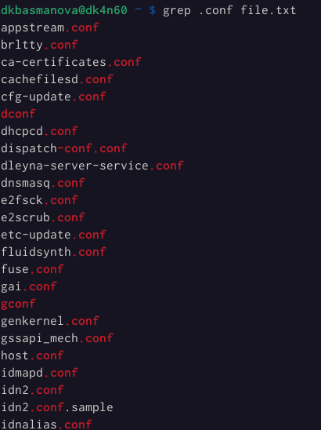{#fig:003 width=40%}
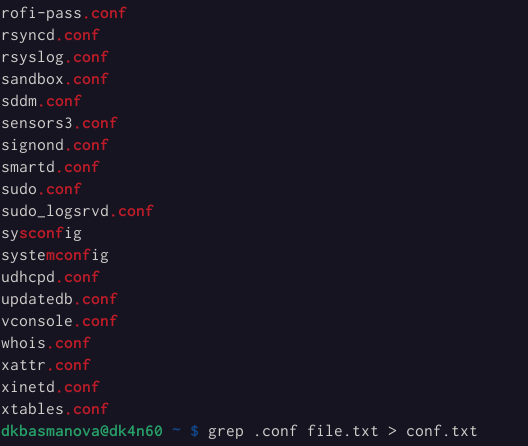{#fig:004 width=40%}

## Описываются проведённые действия, в качестве иллюстрации даётся ссылка на иллюстрацию (рис. @fig:005).

Определила, какие файлы в вашем домашнем каталоге имеют имена, начинавшиеся с символа c. И привела несколько вариантов как это сделать.

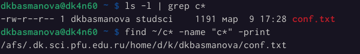{#fig:005 width=50%}

## Описываются проведённые действия, в качестве иллюстрации даётся ссылка на иллюстрацию (рис. @fig:006).

Вывожу на экран (по странично) имена файлов из каталога /etc, начинающиеся с символа h.

{#fig:006 width=40%}
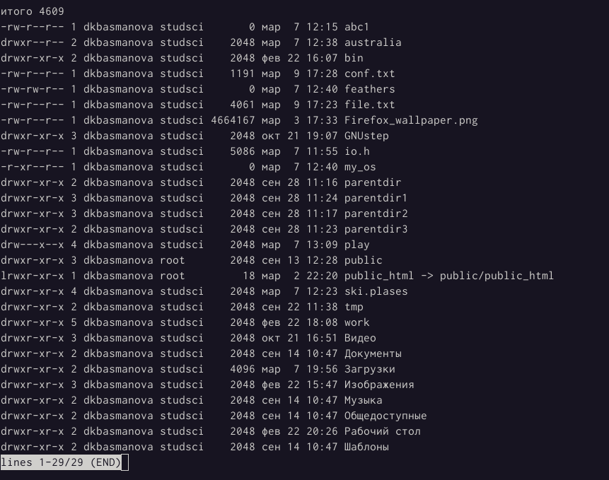{#fig:007 width=40%}

## Описываются проведённые действия, в качестве иллюстрации даётся ссылка на иллюстрацию (рис. @fig:008).

Запустила в фоновом режиме процесс, который будет записывать в файл ~/logfile
файлы, имена которых начинаются с log. 

{#fig:008 width=40%}
{#fig:009 width=40%}

## Описываются проведённые действия, в качестве иллюстрации даётся ссылка на иллюстрацию (рис. @fig:010).

Запустила из консоли в фоновом режиме редактор gedit.
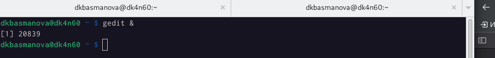{#fig:010 width=40%}
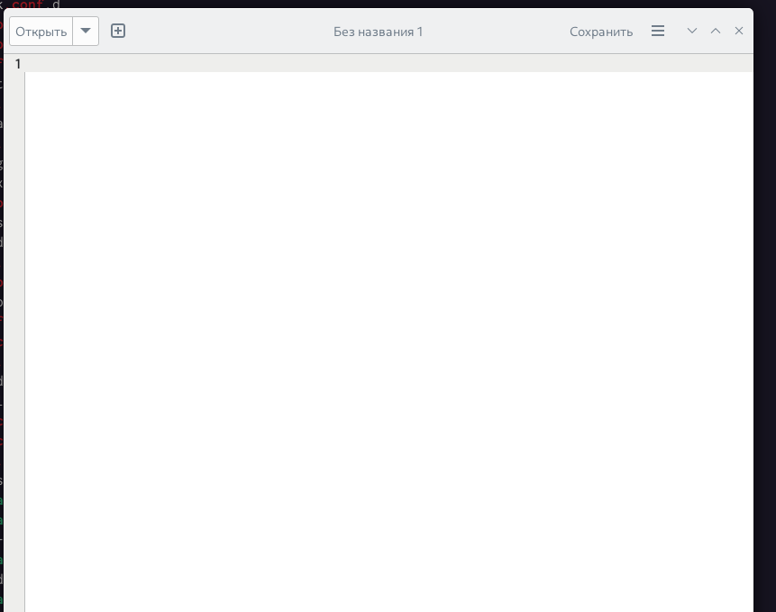{#fig:011 width=40%}

## Описываются проведённые действия, в качестве иллюстрации даётся ссылка на иллюстрацию (рис. @fig:012).

Определила идентификатор процесса gedit, используя команду ps, конвейер и фильтр
grep.
Получила справку Kill и после чего использовала ее для завершения процесса gedit. 
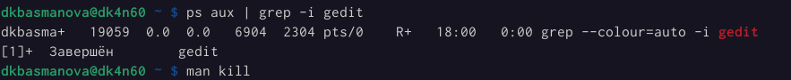{#fig:012 width=40%}
{#fig:013 width=40%}

## Выполнила команды df и du, предварительно получив более подробную информацию об этих командах, с помощью команды man.

{#fig:014 width=40%}
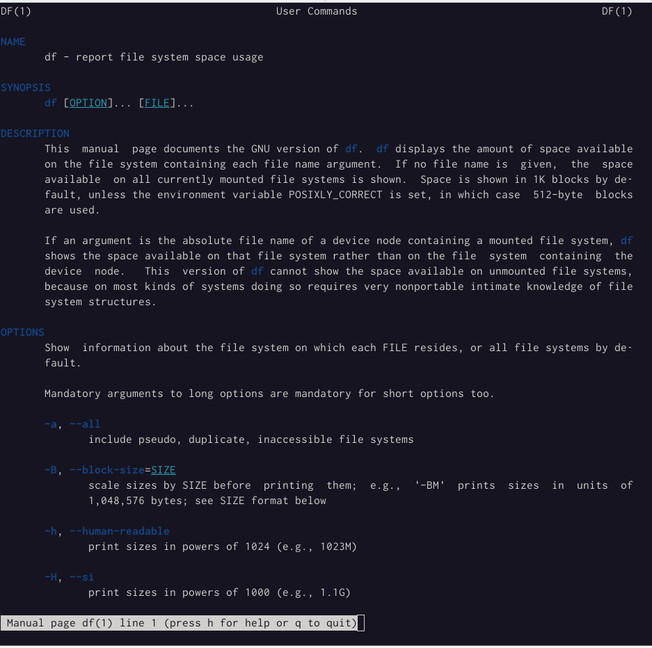{#fig:015 width=40%}
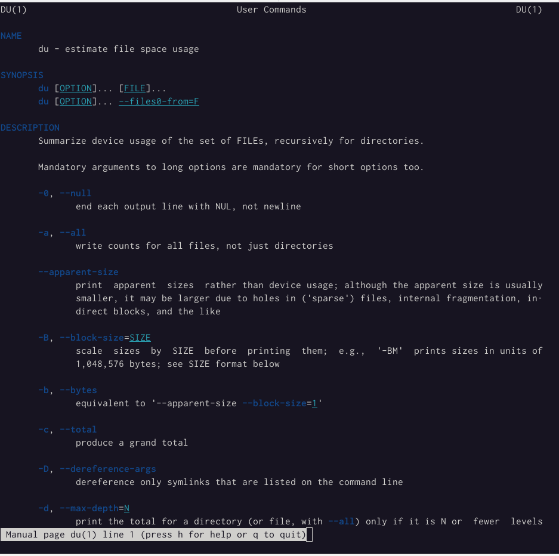{#fig:016 width=40%}
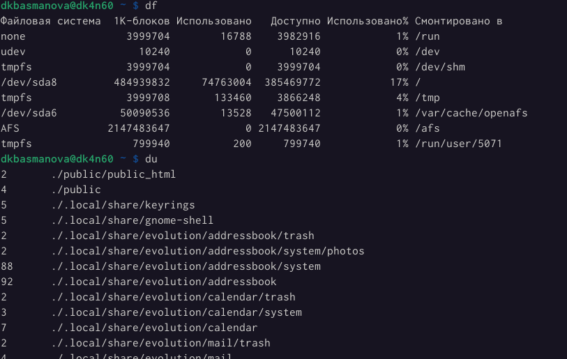{#fig:017 width=40%}

##Описываются проведённые действия, в качестве иллюстрации даётся ссылка на иллюстрацию (рис. @fig:018).

Воспользовавшись справкой команды find, вывожу имена всех директорий, имеющихся в моем домашнем каталоге.

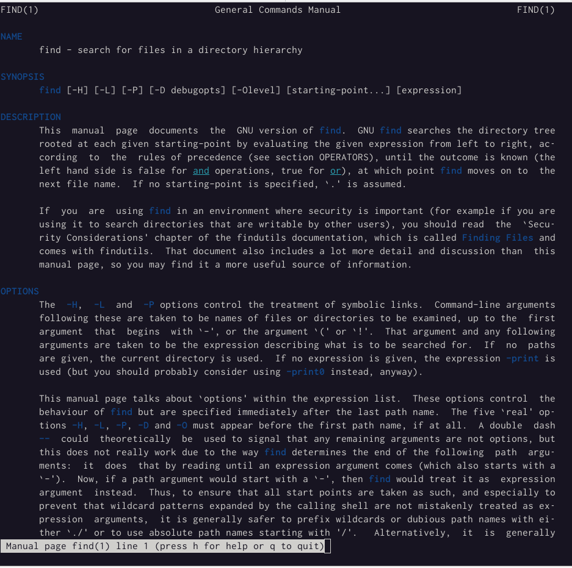{#fig:018 width=50%}
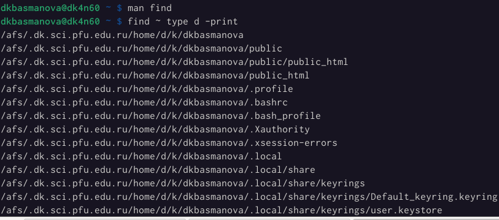{#fig:019 width=50%}

## Результаты

Я ознакомилась с инструментами поиска файлов и фильтрации текстовых данных.
Приобрела практических навыков: по управлению процессами (и заданиями), по
проверке использования диска и обслуживанию файловых систем

