---
## Front matter
title: "Лабораторная работа №6"
subtitle: "Операционные системы"
author: "Басманова Дарья Кириллова"

## Generic otions
lang: ru-RU
toc-title: "Содержание"

## Bibliography
bibliography: bib/cite.bib
csl: pandoc/csl/gost-r-7-0-5-2008-numeric.csl

## Pdf output format
toc: true # Table of contents
toc-depth: 2
lof: true # List of figures

fontsize: 12pt
linestretch: 1.5
papersize: a4
documentclass: scrreprt
## I18n polyglossia
polyglossia-lang:
  name: russian
  options:
	- spelling=modern
	- babelshorthands=true
polyglossia-otherlangs:
  name: english
## I18n babel
babel-lang: russian
babel-otherlangs: english
## Fonts
mainfont: PT Serif
romanfont: PT Serif
sansfont: PT Sans
monofont: PT Mono
mainfontoptions: Ligatures=TeX
romanfontoptions: Ligatures=TeX
sansfontoptions: Ligatures=TeX,Scale=MatchLowercase
monofontoptions: Scale=MatchLowercase,Scale=0.9
## Biblatex
biblatex: true
biblio-style: "gost-numeric"
biblatexoptions:
  - parentracker=true
  - backend=biber
  - hyperref=auto
  - language=auto
  - autolang=other*
  - citestyle=gost-numeric
## Pandoc-crossref LaTeX customization
figureTitle: "Рис."
tableTitle: "Таблица"
listingTitle: "Листинг"
lofTitle: "Список иллюстраций"

lolTitle: "Листинги"
## Misc options
indent: true
header-includes:
  - \usepackage{indentfirst}
  - \usepackage{float} # keep figures where there are in the text
  - \floatplacement{figure}{H} # keep figures where there are in the text
---

# Цель работы

Ознакомление с инструментами поиска файлов и фильтрации текстовых данных.
Приобретение практических навыков: по управлению процессами (и заданиями), по
проверке использования диска и обслуживанию файловых систем.

# Задание

1. Осуществите вход в систему, используя соответствующее имя пользователя.
2. Запишите в файл file.txt названия файлов, содержащихся в каталоге /etc. Допи-
шите в этот же файл названия файлов, содержащихся в вашем домашнем каталоге.
3. Выведите имена всех файлов из file.txt, имеющих расширение .conf, после чего
запишите их в новый текстовой файл conf.txt.
Кулябов Д. С. и др. Операционные системы 59
4. Определите, какие файлы в вашем домашнем каталоге имеют имена, начинавшиеся
с символа c? Предложите несколько вариантов, как это сделать.
5. Выведите на экран (по странично) имена файлов из каталога /etc, начинающиеся
с символа h.
6. Запустите в фоновом режиме процесс, который будет записывать в файл ~/logfile
файлы, имена которых начинаются с log.
7. Удалите файл ~/logfile.
8. Запустите из консоли в фоновом режиме редактор gedit.
9. Определите идентификатор процесса gedit, используя команду ps, конвейер и фильтр
grep. Как ещё можно определить идентификатор процесса?
10. Прочтите справку (man) команды kill, после чего используйте её для завершения
процесса gedit.
11. Выполните команды df и du, предварительно получив более подробную информацию
об этих командах, с помощью команды man.
12. Воспользовавшись справкой команды find, выведите имена всех директорий, имею-
щихся в вашем домашнем каталоге.

# Выполнение лабораторной работы

Описываются проведённые действия, в качестве иллюстрации даётся ссылка на иллюстрацию (рис. @fig:001).

Вошла в систему, осуществляю вход в систему, используя соответствующее имя пользователя. Записываю в файл file.txt названия файлов, содержащихся в каталоге /etc. Дописываю в этот же файл названия файлов, содержащихся в вашем домашнем каталоге.

{#fig:001 width=70%}
{#fig:002 width=70%}

Описываются проведённые действия, в качестве иллюстрации даётся ссылка на иллюстрацию (рис. @fig:003).

Вывожу имена всех файлов из file.txt, имеющих расширение .conf, после чего записываю их в новый текстовой файл conf.txt.

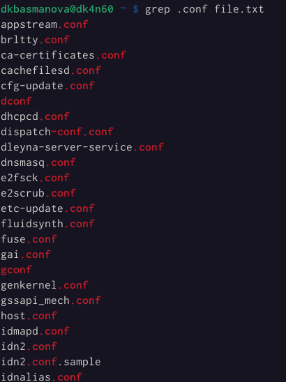{#fig:003 width=70%}
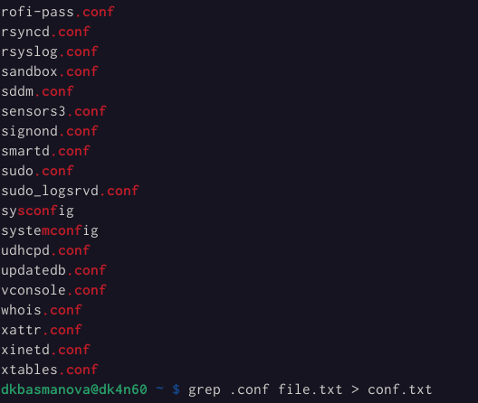{#fig:004 width=70%}

Описываются проведённые действия, в качестве иллюстрации даётся ссылка на иллюстрацию (рис. @fig:005).

Определила, какие файлы в вашем домашнем каталоге имеют имена, начинавшиеся с символа c. И привела несколько вариантов как это сделать.

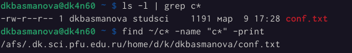{#fig:005 width=70%}

Описываются проведённые действия, в качестве иллюстрации даётся ссылка на иллюстрацию (рис. @fig:006).

Вывожу на экран (по странично) имена файлов из каталога /etc, начинающиеся с символа h.

{#fig:006 width=70%}
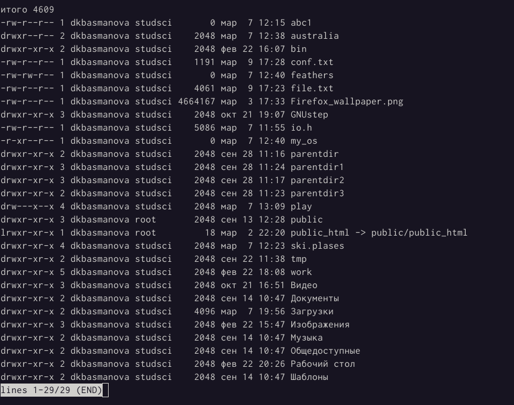{#fig:007 width=70%}

Описываются проведённые действия, в качестве иллюстрации даётся ссылка на иллюстрацию (рис. @fig:008).

Запустила в фоновом режиме процесс, который будет записывать в файл ~/logfile
файлы, имена которых начинаются с log. 

{#fig:008 width=70%}
{#fig:009 width=70%}

Описываются проведённые действия, в качестве иллюстрации даётся ссылка на иллюстрацию (рис. @fig:010).

Запустила из консоли в фоновом режиме редактор gedit.
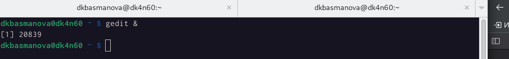{#fig:010 width=70%}
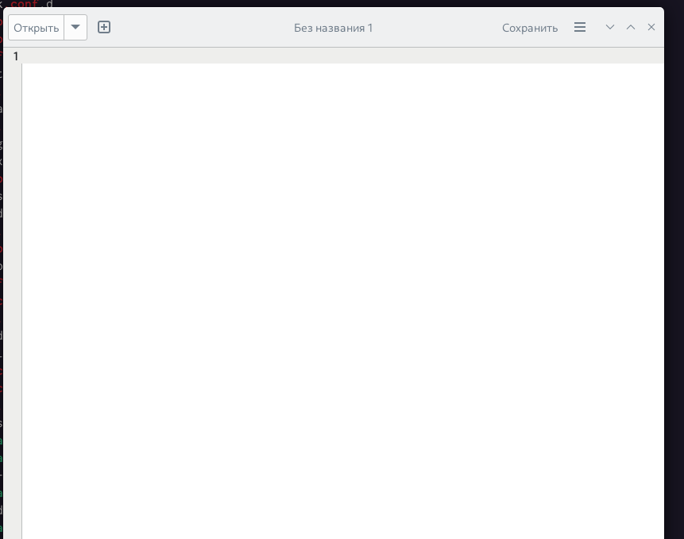{#fig:011 width=70%}

Описываются проведённые действия, в качестве иллюстрации даётся ссылка на иллюстрацию (рис. @fig:012).

Определила идентификатор процесса gedit, используя команду ps, конвейер и фильтр
grep.
Получила справку Kill и после чего использовала ее для завершения процесса gedit. 
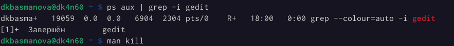{#fig:012 width=70%}
{#fig:013 width=70%}

Описываются проведённые действия, в качестве иллюстрации даётся ссылка на иллюстрацию (рис. @fig:014).

Выполнила команды df и du, предварительно получив более подробную информацию об этих командах, с помощью команды man.

{#fig:014 width=70%}
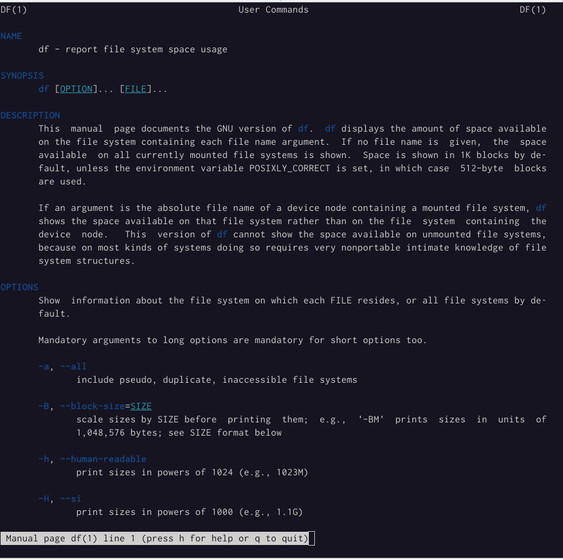{#fig:015 width=70%}
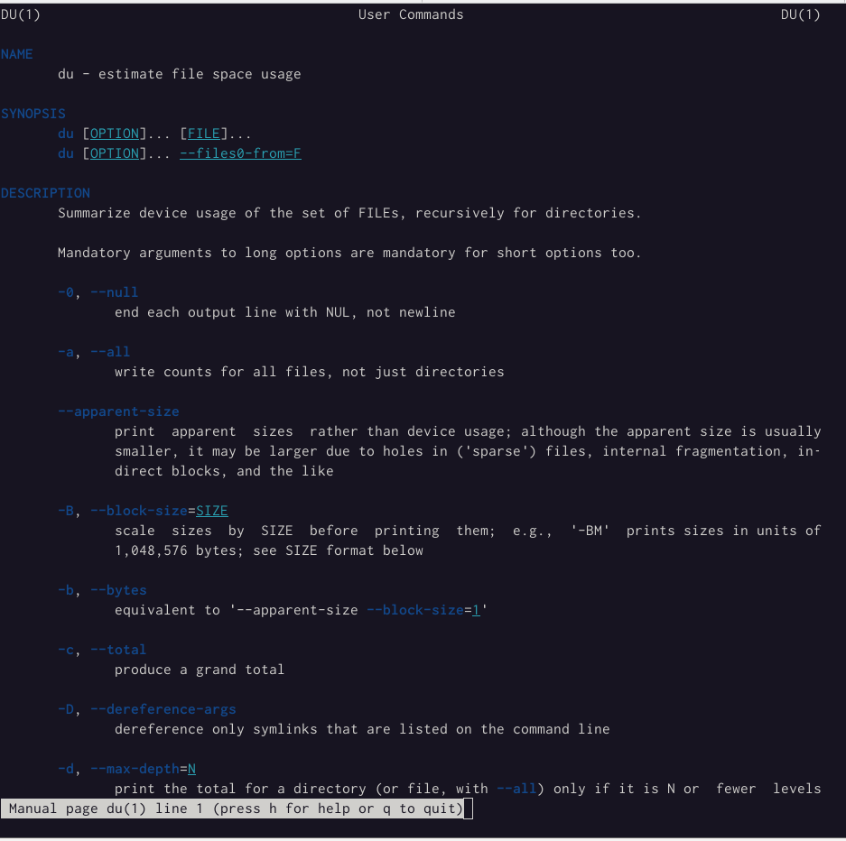{#fig:016 width=70%}
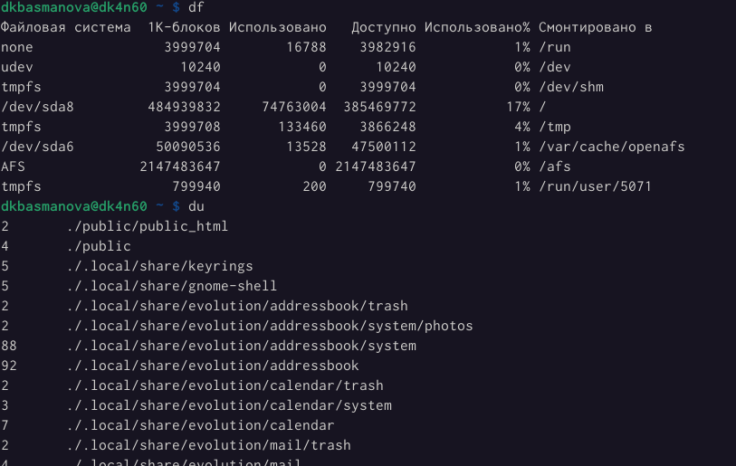{#fig:017 width=70%}

Описываются проведённые действия, в качестве иллюстрации даётся ссылка на иллюстрацию (рис. @fig:018).

Воспользовавшись справкой команды find, вывожу имена всех директорий, имеющихся в моем домашнем каталоге.

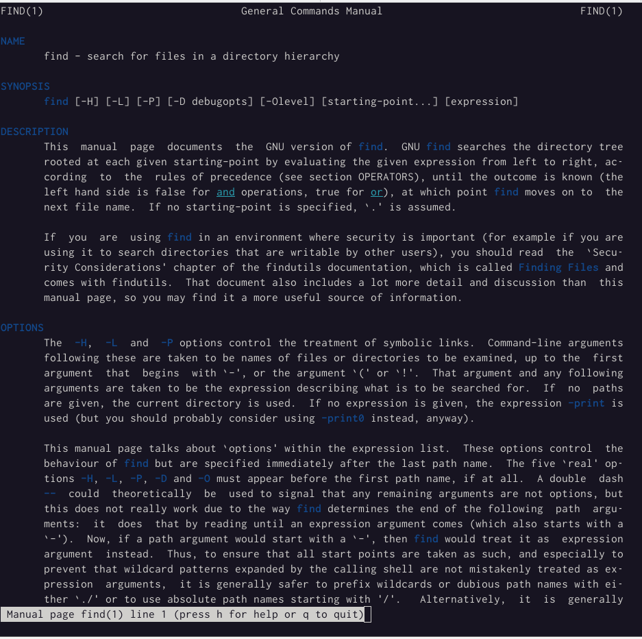{#fig:018 width=70%}
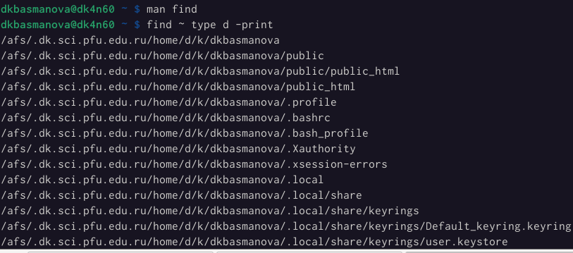{#fig:019 width=70%}

# Выводы

Я ознакомилась с инструментами поиска файлов и фильтрации текстовых данных.
Приобрела практические навыки: по управлению процессами (и заданиями), по
проверке использования диска и обслуживанию файловых систем.

# Список литературы{.unnumbered}

Лабораторная работа № 6.
