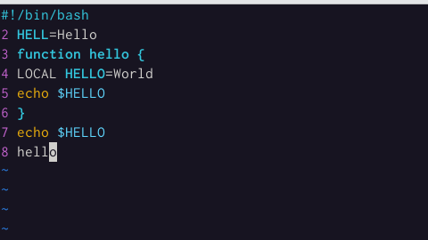
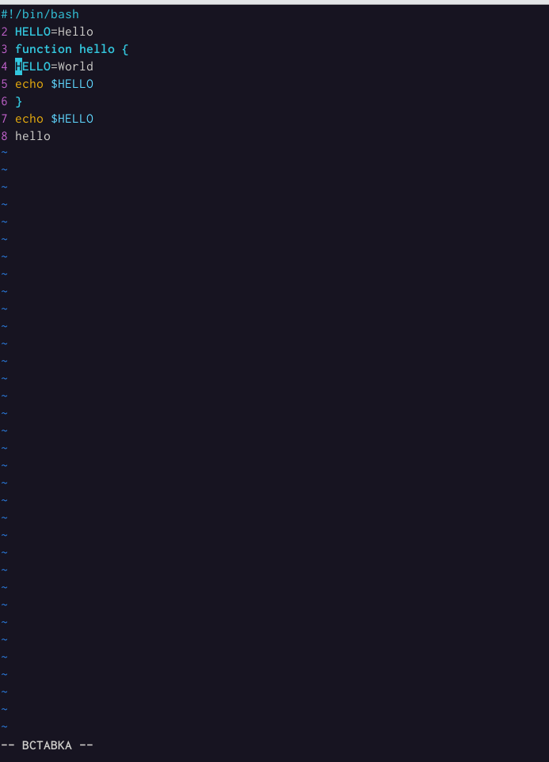
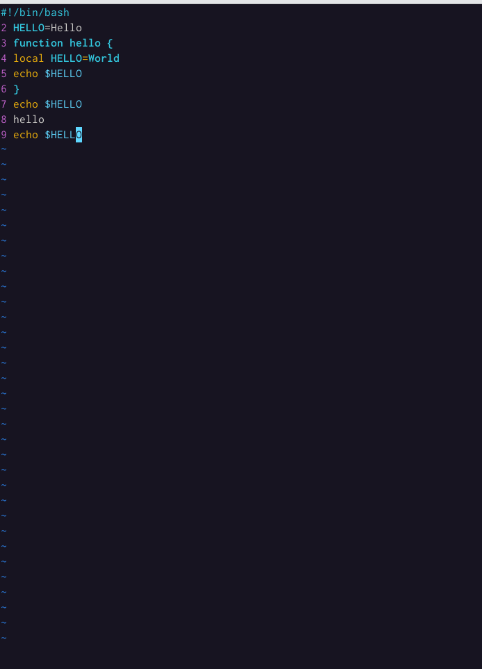
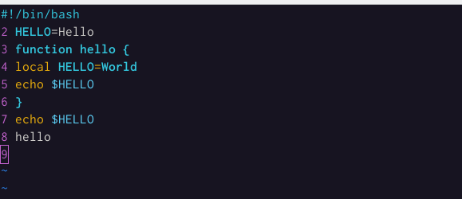

## Front matter
lang: ru-RU
title: "Лабораторная работа №8"
subtitle: "Операционные системы"
author: "Басманова Дарья Кириллова"
institute:
  - Российский университет дружбы народов, Москва, Россия

## i18n babel
babel-lang: russian
babel-otherlangs: english

## Formatting pdf
toc: false
toc-title: Содержание
slide_level: 2
aspectratio: 169
section-titles: true
theme: metropolis
header-includes:
 - \metroset{progressbar=frametitle,sectionpage=progressbar,numbering=fraction}
 - '\makeatletter'
 - '\beamer@ignorenonframefalse'
 - '\makeatother'
---

# Информация

## Докладчик

  * Басманова Дарья Кирилловна
  * Российский университет дружбы народов

# Вводная часть

## Цели и задачи

Познакомиться с операционной системой Linux. Получить практические навыки работы с редактором vi, установленным по умолчанию практически во всех дистрибутивах.

## **Задание 1.**

1. Создайте каталог с именем с ~/work/os/lab06.
2. Перейдите во вновь созданный каталог.
3. Вызовите vi и создайте файл hello.sh
 vi hello.sh
4. Нажмите клавишу i и вводите следующий текст.
1 #!/bin/bash
2 HELL=Hello
3 function hello {
4 LOCAL HELLO=World
5 echo $HELLO
6 }
7 echo $HELLO
8 hello
5. Нажмите клавишу Esc для перехода в командный режим после завершения ввода
текста.
6. Нажмите : для перехода в режим последней строки и внизу вашего экрана появится
приглашение в виде двоеточия.
7. Нажмите w (записать) и q (выйти), а затем нажмите клавишу Enter для сохранения
вашего текста и завершения работы.
8. Сделайте файл исполняемым
 chmod +x hello.sh

## **Задание 2.** Редактирование существующего файла

1. Вызовите vi на редактирование файла
1 vi ~/work/os/lab06/hello.sh
2. Установите курсор в конец слова HELL второй строки.
3. Перейдите в режим вставки и замените на HELLO. Нажмите Esc для возврата в команд-
ный режим.
4. Установите курсор на четвертую строку и сотрите слово LOCAL.
5. Перейдите в режим вставки и наберите следующий текст: local, нажмите Esc для
возврата в командный режим.
6. Установите курсор на последней строке файла. Вставьте после неё строку, содержащую
следующий текст: echo $HELLO.
7. Нажмите Esc для перехода в командный режим.
8. Удалите последнюю строку.
9. Введите команду отмены изменений u для отмены последней команды.
10. Введите символ : для перехода в режим последней строки. Запишите произведённые
изменения и выйдите из vi.

# Результаты

## Описываются проведённые действия, в качестве иллюстрации даётся ссылка на иллюстрацию (рис. @fig:001).

Для начала работы создадим каталог ~/work/os/lab06. Перейдем в созданный каталог.

{#fig:001 width=50%}

##Описываются проведённые действия, в качестве иллюстрации даётся ссылка на иллюстрацию (рис. @fig:002).

Вызовите vi и создайте файл hello.sh

{#fig:002 width=50%}

##Описываются проведённые действия, в качестве иллюстрации даётся ссылка на иллюстрацию (рис. @fig:003).

Для перехода в командный режим после завершения ввода текста с помощью **esc**. Нажимаем **:**. Нажмем **w** (записать) и **q** (выйти), а затем нажмем клавишу **Enter** для сохранения нашего текста и завершения работы.

{#fig:003 width=50%}

##Описываются проведённые действия, в качестве иллюстрации даётся ссылка на иллюстрацию (рис. @fig:004).

Сделаем файл исполняемым с помощью команы chmod +x hello.sh.

{#fig:004 width=50%}

## Описываются проведённые действия, в качестве иллюстрации даётся ссылка на иллюстрацию (рис. @fig:005).

Для начала вызовем vi на редактирование файла и переходим в режим вставка.

{#fig:005 width=50%}

## Описываются проведённые действия, в качестве иллюстрации даётся ссылка на иллюстрацию (рис. @fig:006).

Установим курсор на четвертую строку и сотрем слово LOCAL. 

{#fig:006 width=50%}

## Описываются проведённые действия, в качестве иллюстрации даётся ссылка на иллюстрацию (рис. @fig:007).

Перейдем в режим вставки и наберем следующий текст: local, дальше нажмем **Esc** для возврата в командный режим.

{#fig:007 width=50%}

## Описываются проведённые действия, в качестве иллюстрации даётся ссылка на иллюстрацию (рис. @fig:008).

Установим курсор на последней строке файла. Вставим после неё строку, содержащую
следующий текст: echo $HELLO и нажимаем **Esc** для перехода в командный режим.

{#fig:008 width=50%}

## Описываются проведённые действия, в качестве иллюстрации даётся ссылка на иллюстрацию (рис. @fig:009).

Далее удаляем последнюю строчку и вверед команду отмены изменений u для отмены

{#fig:009 width=50%}

## Итоговый слайд

Я познакомилась с операционной системой Linux. Получила практические навыки работы с редактором vi, установленным по умолчанию практически во всех дистрибутивах.

