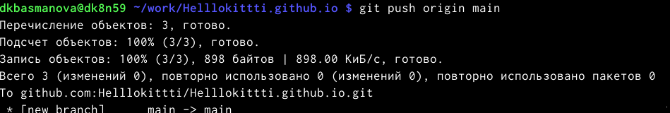

---
## Front matter
lang: ru-RU
title: "Индивидуальный проект 1 этап"
subtitle: "Операционные системы"
author: "Басманова Д.К."
institute:
  - Российский университет дружбы народов, Москва, Россия

## i18n babel
babel-lang: russian
babel-otherlangs: english

## Formatting pdf
toc: false
toc-title: Содержание
slide_level: 2
aspectratio: 169
section-titles: true
theme: metropolis
header-includes:
 - \metroset{progressbar=frametitle,sectionpage=progressbar,numbering=fraction}
 - '\makeatletter'
 - '\beamer@ignorenonframefalse'
 - '\makeatother'
---

# Информация

## Докладчик

:::::::::::::: {.columns align=center}
::: {.column width="70%"}

  * 
  * Басманова Д.К.
  * студент НБИбд-01-22
  * Российский университет дружбы народов


:::
::: {.column width="30%"}


# Вводная часть


## Цели и задачи
Создание своего личного сайта. Размещение на Github pages заготовки для персонального сайта.

## Материалы и методы

- Процессор `pandoc` для входного формата Markdown
- Результирующие форматы
	- `pdf`
	- `html`
- Автоматизация процесса создания: `Makefile`

# Создание презентации

## Процессор `pandoc`

- Pandoc: преобразователь текстовых файлов
- Сайт: <https://pandoc.org/>
- Репозиторий: <https://github.com/jgm/pandoc>

## Формат `pdf`

- Использование LaTeX
- Пакет для презентации: [beamer](https://ctan.org/pkg/beamer)
- Тема оформления: `metropolis`

## Код для формата `pdf`

```yaml
slide_level: 2
aspectratio: 169
section-titles: true
theme: metropolis
```

## Формат `html`

- Используется фреймворк [reveal.js](https://revealjs.com/)
- Используется [тема](https://revealjs.com/themes/) `beige`

## Код для формата `html`

- Тема задаётся в файле `Makefile`

```make
REVEALJS_THEME = beige 
```
# Результаты

## Получающиеся форматы

- Полученный `pdf`-файл можно демонстрировать в любой программе просмотра `pdf`
- Полученный `html`-файл содержит в себе все ресурсы: изображения, css, скрипты

# Элементы презентации

## Выполнение

- 1)Скачиваем сайт hugo для генерирования страниц сайта.

2) Скачиваем последнюю версию.

3)Разархивируем скаченный файл и извлекаем его. 

4)Копируем извлеченный файл в папку на домашнем столе bin.

5)Создаем новый репозиторий, называем его blog и клонируем его через терминал.

{#fig:001 width=90%} 

{#fig:002 width=90%}

6) переходим в это репозиторий через терминал.

{#fig:003 width=90%}

7)Располагаем его в каталоге пользователя и открывается сайт.


8)Чтобы избавиться от голубой вывески мы заходим в папку content и в файле индекс вырезаем часть текста с 8 строки до 38.И мы видим что эта вывеска исчезла.
##
{#fig:004 width=90%}

{#fig:005 width=90%}


9) Создаем еще один репозиторий  и в терминале переходим на блог выше.

{#fig:006 width=90%}

{#fig:007 width=90%}

10)Клонируем новый репозиторий. И переходим в него через терминал.

{#fig:008 width=90%}

{#fig:009 width=90%}

11)Так как репозиторий новый  создаем ветку которая будет называтьяс main.

{#fig:010 width=90%}
12)Создаем пустой файл и добавляем это в репозиторий.
##
13)Копируем репозиторий и добавляем папку public.Но в гитигноре есть команда public которая игнориуется и мы ее исправляем в mc.

14)Убеждаемся что мы закомментировали public.И повторяем команду с копированием репозитория.
{#fig:011 width=90%}
15)Выполняю команду bin/hugo

16)Переходим в папку public и проверяем что он подключен.Затем добавляе все в репозитрорий.

17)Копируем ссылку нашего личного сайти и вставляем ее в браузер.


:::

